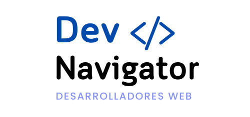

<!DOCTYPE html>
<html lang="es">
<head>
    <meta charset="UTF-8">
    <meta name="viewport" content="width=device-width, initial-scale=1.0">
    </head>
<body>

  

<h1>DevNavigator Backend 💻🖥️💙</h1>

<h2>Descripción del Proyecto 🤓</h2>

  El backend de DevNavigator se encarga de gestionar la lógica del servidor, la base de datos y la autenticación de usuarios. Está diseñado para ser escalable y eficiente, proporcionando una API robusta para la interacción con el frontend.

<h2>Instalaciones Necesarias 🛠️</h2>
<ul>
  <li><strong>Node.js</strong>: <code>https://nodejs.org/</code></li>
  <li><strong>PostgreSQL</strong>: <code>https://www.postgresql.org/</code></li>
  <li><strong>NestJS CLI</strong>: <code>npm install -g @nestjs/cli</code></li>
  <li><strong>Dependencias del proyecto:</strong></li>
  <ul>
    <li><code>npm install @nestjs/common @nestjs/core @nestjs/platform-express @nestjs/config @nestjs/jwt @nestjs/typeorm @nestjs/swagger @nestjs/schedule @nestjs/mapped-types</code></li>
    <li><code>npm install bcrypt class-transformer class-validator cloudinary dotenv nodemailer pg reflect-metadata rxjs typeorm</code></li>
  </ul>
</ul>

<h2>Configuración del Proyecto ⚙️</h2>
<ol>
  <li>Clona el repositorio: <code>git clone https://github.com/DevNavigator/DevNavigatorBackend.git</code></li>
  <li>Instala las dependencias: <code>npm install</code></li>
  <li>Crea un archivo <code>.env</code> y configura tus variables de entorno.</li>
  <li>Inicia el servidor: <code>npm run start</code></li>
</ol>

<h2>Funcionalidades del Backend 👾</h2>
<ul>
  <li>Autenticación de usuarios mediante JWT</li>
  <li>Gestión de usuarios y roles</li>
  <li>Almacenamiento de datos en PostgreSQL</li>
  <li>Documentación de la API con Swagger</li>
  <li>Notificaciones en tiempo real</li>
</ul>

<h2>Integrantes del Equipo Backend de este proyecto 👥</h2>
<table>
  <tr>
    <th>Integrante</th>
    <th>Rol</th>
  </tr>
    <tr>
    <td><strong>Rivera López, Jorge Eduardo</strong></td>
    <td>Backend</td>
  </tr>
  <tr>
    <td><strong>Di Donna Ramirez, John Alexander</strong></td>
    <td>BackEnd</td>
  </tr>
  <tr>
    <td><strong>Martinez, Mauricio</strong></td>
    <td>Backend</td>
  </tr>
</table>

<h2>Documentación del Proyecto 📚</h2>

  Este proyecto utiliza varias herramientas y bibliotecas para mejorar su funcionalidad. A continuación se detallan las implementaciones clave:

<h3>Swagger 📄</h3>

  Swagger se utiliza para documentar la API de manera interactiva. Para acceder a la documentación, inicia el servidor y visita <code>http://localhost:3001/api</code>. Swagger proporciona una interfaz gráfica que te permite probar los endpoints de la API directamente.

<h3>Nodemailer ✉️</h3>

  Nodemailer se utiliza para enviar correos electrónicos. La configuración se realiza a través de variables de entorno en el archivo <code>.env</code>. Puedes personalizar los correos electrónicos enviados a los usuarios, como la verificación de cuentas y notificaciones.

<h3>Cron Jobs ⏰</h3>

  Los Cron Jobs se configuran utilizando el módulo <code>@nestjs/schedule</code>. Permiten ejecutar tareas programadas, como el envío de recordatorios o la limpieza de datos. La configuración se realiza en el módulo correspondiente, donde puedes definir la frecuencia y la tarea a ejecutar.

<h3>Cloudinary ☁️</h3>

  Cloudinary se utiliza para la gestión y almacenamiento de imágenes. La configuración se realiza a través de las variables de entorno en el archivo <code>.env</code>. Puedes subir imágenes y obtener URLs para usarlas en la aplicación. Asegúrate de tener las credenciales correctas en tu archivo de configuración.

  Para más información, consulta la documentación completa en el repositorio.

    
&copy; 2024 DevNavigator. Todos los derechos reservados.

</body>
</html>
